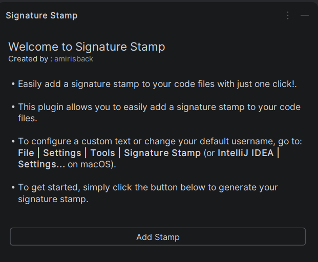
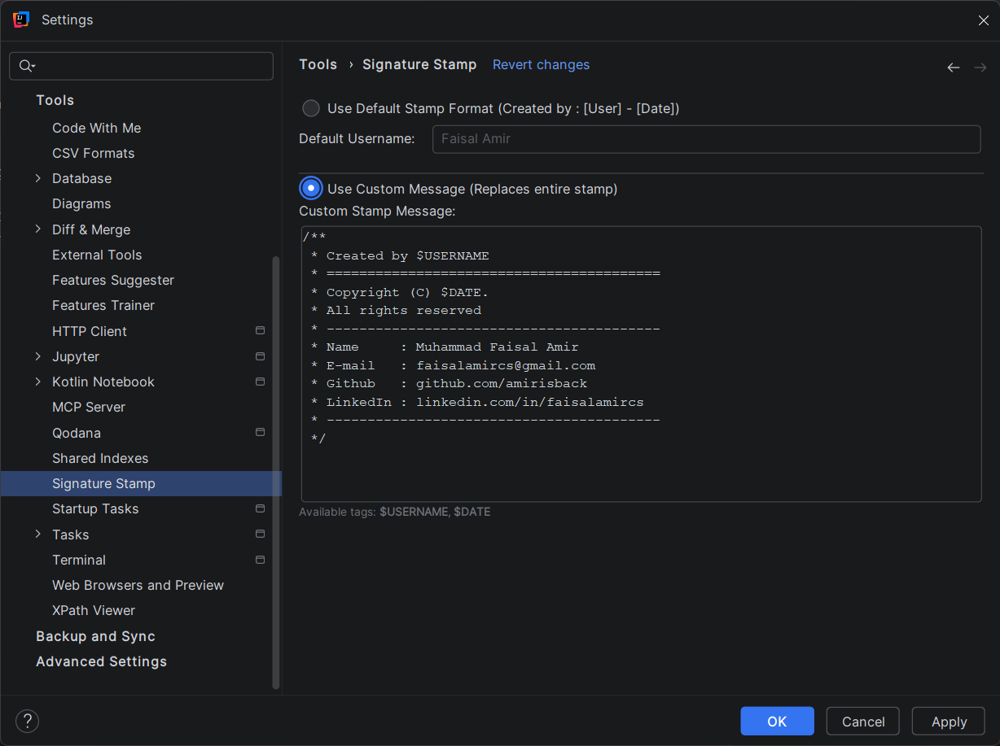
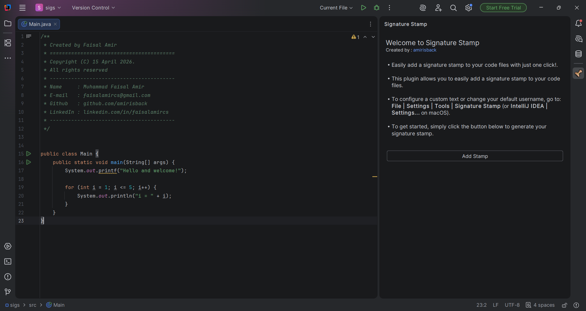

# Signature Stamp

**Signature Stamp** is a JetBrains IDE plugin designed to help developers effortlessly insert signature stamps or custom messages right into their code files. With a simple, accessible Tool Window side panel, generating tracking notes or signature watermarks becomes a one-click affair!

## Key Features

- **Quick Insert:** Insert a timestamped signature directly at your cursor via a dedicated Tool Window button.
- **Default Formatting:** Automatically fetches your OS username and parses `[Username] - [Date]` seamlessly.
- **Fully Customizable:** Prefer a block comment ascii-art or personalized structure? Switch to the "Custom Message" mode to specify entirely what you want included.
- **Dynamic Tags Support:** Inject `$USERNAME` and `$DATE` dynamically within your custom stamps – automatically resolving upon each insertion!
- **IDE Settings Integration:** All customization options are securely saved right in the IDE Preferences (`Settings > Tools > Signature Stamp`).

---

## Previews & Screenshots

### The Tool Window & Settings UI

---

## Getting Started

1. Open **Settings | Plugins** in your JetBrains IDE.
2. Search for `Signature Stamp` in the Marketplace.
3. Install and restart the IDE.
4. Click on the **Signature Stamp** Tool Window typically found on your right sidebar (or via `View > Tool Windows > Signature Stamp`).
5. To configure your custom stamps, navigate to **File | Settings... | Tools | Signature Stamp**.
6. Enjoy!

## Development & Contribution

This plugin is built using the new IntelliJ Platform Plugin Template.
- **`runIde`**: Run this Gradle task to spin up a sandbox instance for testing local changes.
- Ensure your changes follow JetBrains Marketplace UI guidelines.

Developed by [Faisal Amir (amirisback)](https://github.com/amirisback).
